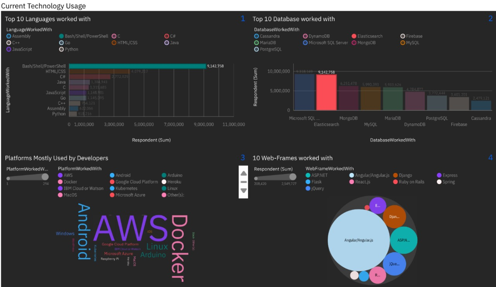

# IBM-Data-Analyst-Tasks
This project is part of the Data Analyst Professional Certificate by IBM. The focus is considering yourself an associate Data Analyst for a company working on a project analyzing data from Stack Overflow, a well-known platform for developers. Stack Overflow conducted a detailed online survey of software professionals worldwide, gathering around 90,000 responses. This rich dataset was later open-sourced, providing a valuable resource for analysis.

The project workflow involves several key steps:

Data Extraction:

The dataset was extracted using SQL, ensuring a solid foundation for subsequent analysis.

Data Exploration and Processing:

Initial exploration and processing were conducted to clean and prepare the data. This step involved handling missing values, normalizing data formats, and ensuring overall data quality.
Data Analysis:

A range of analytical techniques were applied to uncover insights from the data. This included statistical analysis and identifying trends and patterns within the responses.
Data Visualization:

Various visualization techniques were employed to represent the data insights clearly. Charts, graphs, and other visual aids were created to make the data more accessible and understandable using Matplotlib and seaborn.

Dashboard and Presentation:

A comprehensive dashboard was built to showcase the findings. This dashboard provides an interactive way to explore the insights derived from the data using IBM cognos lab.
A presentation was also created to summarize the key findings and insights, providing a clear and concise overview of the project outcomes.
This project demonstrates the entire process of data analysis, from extraction and processing to analysis and visualization, culminating in a dashboard and presentation that effectively communicate the insights gained from the Stack Overflow survey data.

Dashboards:

Link: https://us3.ca.analytics.ibm.com/bi/?perspective=dashboard&pathRef=.my_folders%2FCoursera&action=view&mode=dashboard&subView=model000001912086f582_00000000
